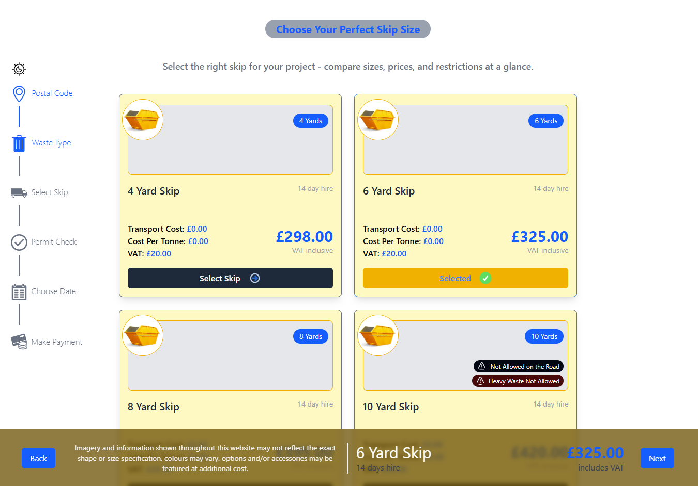

<a name="readme-top"></a>

<div align="center">

 <!-- LOGO -->

  
  <br/>

<!-- MAIN HEADING -->

  <h3><b>Garden Waste</b></h3>

</div>

<!-- TABLE OF CONTENTS -->

# 📗 Table of Contents

- [📖 About the Project](#about-project)
  - [🛠 Development Structure](#structure)
  - [🛠 Built With](#built-with)
    - [Tech Stack](#tech-stack)
    - [Key Features](#key-features)
- [🚀 Live Demo](#live-demo)
- [💻 Getting Started](#getting-started)
  - [Setup](#setup)
  - [Prerequisites](#prerequisites)
  - [Install](#install)
  - [Usage](#usage)
  - [Run tests](#run-tests)
  - [Deployment](#deployment)
- [👥 Authors](#authors)
- [🔭 Future Features](#future-features)
- [🤝 Contributing](#contributing)
- [⭐️ Show your support](#support)
- [🙏 Acknowledgements](#acknowledgements)
- [❓ FAQ (OPTIONAL)](#faq)
- [📝 License](#license)

<!-- INTRO -->

# 📖 Garden Waste<a name="about-project"></a>
rem waste
> Garden Waste is a redesigned Skip selection page from [REM Waste website](https://wewantwaste.co.uk/). It allows the user select from a variety of displayed Skips showcasing their images, sizes, permissions, and pricing. It is part of the process for booking to rent a Skip. Data used in the app is by the kindest courtesy of [REM Waste](https://app.wewantwaste.co.uk/api/skips/by-location?postcode=NR32&area=Lowestoft).

## 🛠 Development Structure <a name="structure"></a>

1. The app starts with a single SelectSkip.jsx page which is rendered through the App.jsx.
2. The progress is in a separate Progress.jsx component, also rendered through the App.jsx. The progress component is static and doesnt move during scrolling.
3. I fetched the data in the SelectSkip.jsx file, mapped through them, and rendered each Skip using a SkipCard.jsx component.
4. I also added a Loader.jsx component to display when the data is being fetched.
5. I created re-suable components (ButtonState.jsx, CostComponent.jsx, and PermissionComponent.jsx) to void unnecessary repetions.
6. The icons for the progress component were imported from a constants component named Icons.jsx.
7. The colors of the icons as well as their captions change when a step is completed.
8. I also created a SelectionDetail.jsx component which opens to display information about the selected skip. The same component also gives the user the opportunity to either move Next or Back. The component only renders when a skip is selected.
9. I used both Local and Global states to manage the skips state as and when necessary.
10. I added a theme toggle above the progress indicator to switch between light and dark modes.
11. The page is mobile responsive.
12. Hovering over cards tilt them upwards and they move down when the cursor leaves them.
13. Hovering over an image on a card enlarges the image for a better view.
14. Selected Cards remain tilted upwards until they are deselcted.
15. I tried my best to keep in mind clean, maintainable react code, responsiveness, and UI/UX improvements.

## 🛠 Built With <a name="built-with"></a>

1. React
2. Taiwind CSS

### Tech Stack <a name="tech-stack"></a>

<details>
  <summary>Client</summary>
  <ul>
    <li><a href="https://reactjs.org/">React</a></li>
    <li><a href="https://tailwindcss.com/">Tailwind CSS</a></li>
  </ul>
</details>

<!-- Features -->

### Key Features <a name="key-features"></a>

> - View Skips.
> - Select Skips.
> - Selected Skips are stored in local storage and stay when the page is refreshed.
> - Track progress
> - Next button saves the selected skip and moves to the next page.

<p align="right">(<a href="#readme-top">back to top</a>)</p>

<!-- LIVE DEMO -->

LIVE DEMO

> The project is not yet deployed.

<p align="right">(<a href="#readme-top">back to top</a>)</p>

<!-- GETTING STARTED -->

## 💻 Getting Started <a name="getting-started"></a>

> To get a local copy of the project, use this link:

```sh
cd garden_waste
https://github.com/anyars-encarta/garden_waste.git
```

<!-- SETUP -->

### Setup

To setup this project, run this command:

```sh
npm install
```

### Prerequisites

1. A Browser (Preferably Google Chrome)
2. A Code Editor
3. Internet Connection
4. Git

<!-- INSTALL -->

### Install

Install this project with Iroko.

### Usage

To run the project, execute the following command:

```sh
npm run dev
```

### Run tests

### Deployment

You can deploy this project using:

> 1. GitHub Pages
> 2. Vercel
> 3. Netlify
> 4. Any other hosting site

<p align="right">(<a href="#readme-top">back to top</a>)</p>

<!-- AUTHORS -->

## 👥 Authors <a name="authors"></a>

👤 **Anyars Yussif**

- GitHub: [@anyars-encarta](https://github.com/anyars-encarta)
- Twitter: [@anyarsencarta](https://twitter.com/anyarsencarta)
- LinkedIn: [LinkedIn](https://www.linkedin.com/in/anyars-yussif/)

<p align="right">(<a href="#readme-top">back to top</a>)</p>

## 🔭 Future Features <a name="future-features"></a>

- [ ] **Permit Check Page**
- [ ] **Date Selection Page**
- [ ] **Payment Page**

<p align="right">(<a href="#readme-top">back to top</a>)</p>

<!-- CONTRIBUTION -->

## 🤝 Contributing <a name="contributing"></a>

Contributions, issues, and feature requests are welcome!

<p align="right">(<a href="#readme-top">back to top</a>)</p>

<!--SUPPORT -->

## ⭐️ Show your support <a name="support"></a>

> If you like this project, please give it some stars ⭐️⭐️⭐️⭐️⭐️

<p align="right">(<a href="#readme-top">back to top</a>)</p>

<!-- ACKNOWLEDGEMENTS -->

## 🙏 Acknowledgments <a name="acknowledgements"></a>

> Special credit to [REM Waste](https://wewantwaste.co.uk/) for giving me the opportunity to rebuild their page.

<p align="right">(<a href="#readme-top">back to top</a>)</p>

<!-- FAQS -->

## ❓ FAQ (OPTIONAL) <a name="faq"></a>

- **How were the React and Linters utilised?**

  - The React and Linters were utilised with the help of resources provided by Vite.

- **What new features should be expected in the next release of the project?**

  - I am currently planning on working on the Permit Check, Date Selection, and Payment pages.

<p align="right">(<a href="#readme-top">back to top</a>)</p>

<!-- LICENSE -->

## 📝 License <a name="license"></a>

This project is is a sole property of [REM Waste](https://wewantwaste.co.uk/) and all rights are reserved for them.

<p align="right">(<a href="#readme-top">back to top</a>)</p>
